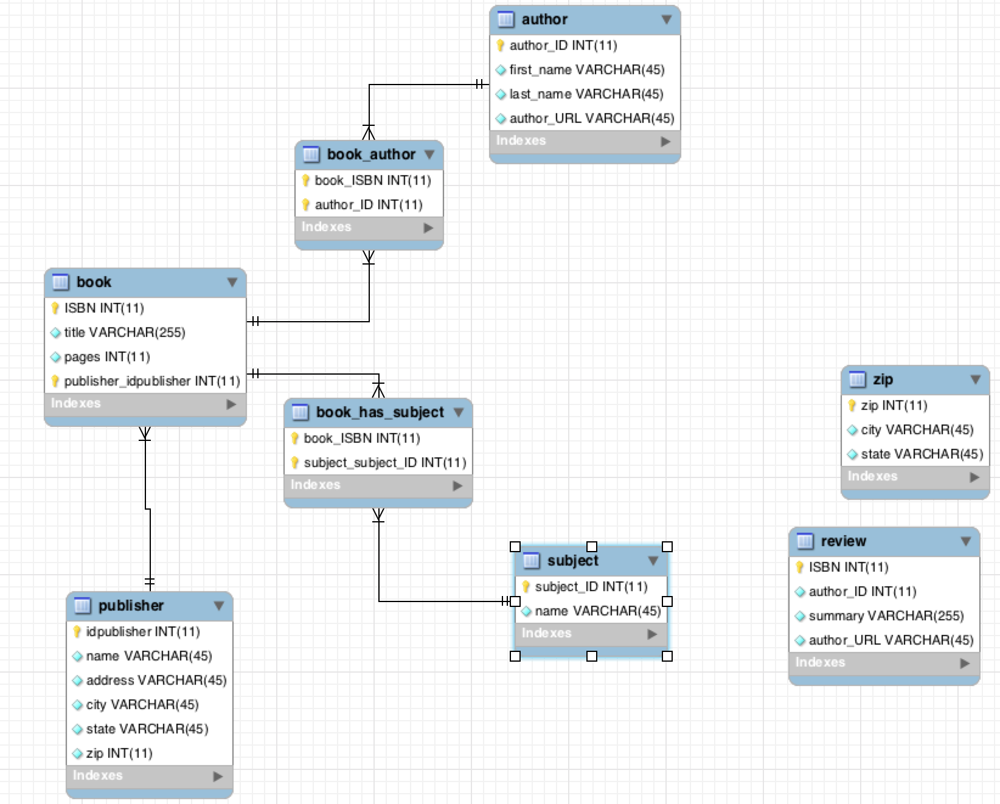
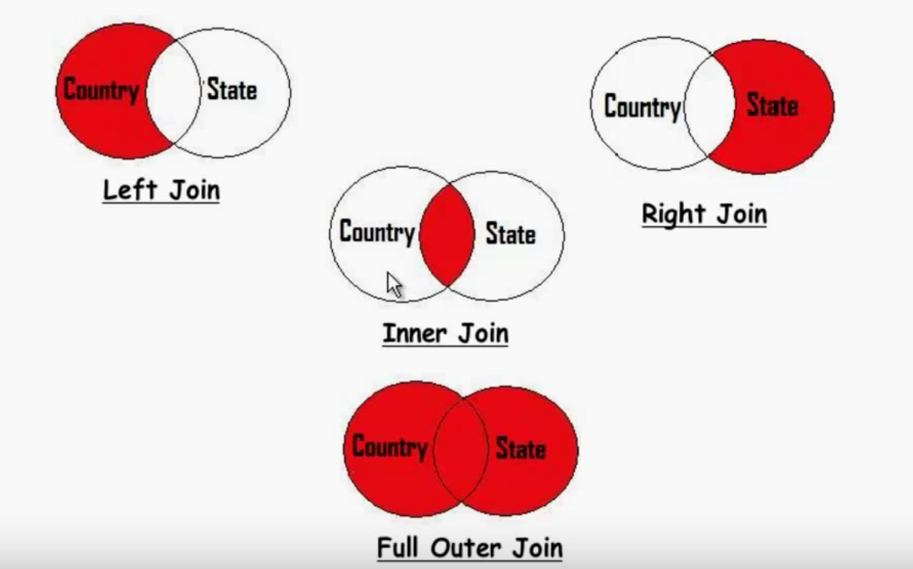

## TASK #1 continued - EXAMPLES

- Try out the different joins – left, right, inner and outer

For the purpose of this excercise, I followed example found http://mikehillyer.com/articles/an-introduction-to-database-normalization/ that was recommended as a reading material. I wanted to get familiar with database normalization as well as using inner, outer, full joins.


## Example #1 - Mike’s Bookstore

- Title
- Author
- Author Biography
- ISBN
- Price
- Subject
- Number of Pages
- Publisher
- Publisher Address
- Description
- Review
- Reviewer Name


Typical approach:

```
CREATE DATABASE bookstore;
```

```
CREATE  TABLE `bookstore`.`books` (
  `title` VARCHAR(255) NOT NULL DEFAULT '' ,
  `author` VARCHAR(45) NOT NULL DEFAULT '' ,
  `bio` VARCHAR(45) NOT NULL DEFAULT '' ,
  `ISBN` INT NOT NULL DEFAULT 0 ,
  `subject` VARCHAR(45) NOT NULL DEFAULT '' ,
  `pages` INT NOT NULL DEFAULT 0 ,
  `publisher` VARCHAR(45) NOT NULL DEFAULT '' ,
 );
```

```
INSERT INTO `bookstore`.`books` (`title`, `author`, `bio`, `ISBN`, `subject`, `pages`, `publisher`) VALUES ('Beginning MySQL Database Design and Optimization', 'Chad Russell, Jon Stephens	', 'Chad Russell is a programmer and network administrator who owns his own Internet hosting company., Jon Stephens is a member of the MySQL AB documentation team.	1590593324	', '1590593324	', 'MySQL, Database Design', '520', 'Apress');
```

```
mysql> describe books;
+-----------+--------------+------+-----+---------+-------+
| Field     | Type         | Null | Key | Default | Extra |
+-----------+--------------+------+-----+---------+-------+
| ISBN      | int(11)      | NO   | PRI | NULL    |       |
| title     | varchar(255) | NO   |     |         |       |
| author    | varchar(45)  | NO   |     |         |       |
| bio       | varchar(255) | NO   |     |         |       |
| subject   | varchar(45)  | NO   |     |         |       |
| pages     | int(11)      | NO   |     | 0       |       |
| publisher | varchar(45)  | NO   |     |         |       |
+-----------+--------------+------+-----+---------+-------+
8 rows in set (0.00 sec)
```
```
mysql> SELECT * FROM books \G
*************************** 1. row ***************************
  idbooks: 101
    title: Beginning MySQL Database Design
   author: Chad Russell, Jon Stephens
      bio: Chad Russell is a programmer and network administrator who owns his own Internet hosting company., Jon Stephens is a member of the MySQL AB documentation team.	1590593324
     ISBN: 1590593324
  subject: MySQL, Database Design
    pages: 520
publisher: Apress
1 row in set (0.00 sec)
```

Table created this way is subject to several anomalies.

- Insertion anomaly - we cannot list publishers or authors without having a book because the ISBN is a primary key which cannot be NULL
- Deletion anomaly - we cannot delete a book without losing information on the authors and publisher
- Update anomaly - when updating information, such as an author’s name, we must change the data in every row, potentially corrupting data

**Normalization is a part of relational theory, which requires that each relation (AKA table) has a primary key.**

Also, this table is not very efficient with storage and this design does not protect data consistency.

## First Normal Form

The first normal form (or 1NF) requires that the values in each column of a table are atomic. By atomic we mean that there are no sets of values within a column.

One method for bringing a table into first normal form is to separate the entities contained in the table into separate tables. In our case this would result in Book, Author, Subject and Publisher tables.


CREATE table book
```
CREATE  TABLE `bookstore`.`book` (
  `ISBN` INT NOT NULL ,
  `title` VARCHAR(255) NOT NULL DEFAULT '' ,
  `pages` INT NOT NULL DEFAULT 0 ,
  PRIMARY KEY (`ISBN`) );
```

```
mysql> describe book;
+-------+--------------+------+-----+---------+-------+
| Field | Type         | Null | Key | Default | Extra |
+-------+--------------+------+-----+---------+-------+
| ISBN  | int(11)      | NO   | PRI | NULL    |       |
| title | varchar(255) | NO   |     |         |       |
| pages | int(11)      | NO   |     | 0       |       |
+-------+--------------+------+-----+---------+-------+
3 rows in set (0.00 sec)
```

```
INSERT INTO `bookstore`.`book` (`ISBN`, `title`) VALUES ('1590593324	', 'Beginning MySQL Database Design and Optimization');
```


```
mysql> SELECT * FROM book;
+------------+--------------------------------------------------+-------+
| ISBN       | title                                            | pages |
+------------+--------------------------------------------------+-------+
| 1590593324 | Beginning MySQL Database Design and Optimization |   520 |
+------------+--------------------------------------------------+-------+
1 row in set (0.01 sec)
```

CREATE table author
```
CREATE  TABLE `bookstore`.`author` (
  `author_ID` INT NOT NULL ,
  `first_name` VARCHAR(45) NOT NULL DEFAULT '' ,
  `last_name` VARCHAR(45) NOT NULL DEFAULT '' ,
  PRIMARY KEY (`author_ID`) );
```


```
mysql> describe author;
+------------+-------------+------+-----+---------+-------+
| Field      | Type        | Null | Key | Default | Extra |
+------------+-------------+------+-----+---------+-------+
| author_ID  | int(11)     | NO   | PRI | NULL    |       |
| first_name | varchar(45) | NO   |     |         |       |
| last_name  | varchar(45) | NO   |     |         |       |
+------------+-------------+------+-----+---------+-------+
3 rows in set (0.00 sec)
```

```
INSERT INTO `bookstore`.`author` (`author_ID`, `first_name`, `last_name`) VALUES ('1', 'Chad', 'Russell');
INSERT INTO `bookstore`.`author` (`author_ID`, `first_name`, `last_name`) VALUES ('2', 'Jon', 'Stephens');
INSERT INTO `bookstore`.`author` (`author_ID`, `first_name`, `last_name`) VALUES ('3', 'Mike', 'Hillyer');
```

```
mysql> SELECT * FROM author;
+-----------+------------+-----------+
| author_ID | first_name | last_name |
+-----------+------------+-----------+
|         1 | Chad       | Russell   |
|         2 | Jon        | Stephens  |
|         3 | Mike       | Hillyer   |
+-----------+------------+-----------+
3 rows in set (0.00 sec)
```


CREATE table subject
```
CREATE  TABLE `bookstore`.`subject` (
  `subject_ID` INT NOT NULL ,
  `name` VARCHAR(45) NOT NULL DEFAULT '' ,
  PRIMARY KEY (`subject_ID`) );
```


```
mysql> describe subject;
+------------+-------------+------+-----+---------+-------+
| Field      | Type        | Null | Key | Default | Extra |
+------------+-------------+------+-----+---------+-------+
| subject_ID | int(11)     | NO   | PRI | NULL    |       |
| name       | varchar(45) | NO   |     |         |       |
+------------+-------------+------+-----+---------+-------+
2 rows in set (0.00 sec)
```

```
INSERT INTO `bookstore`.`subject` (`subject_ID`, `name`) VALUES ('1', 'MySQL');
INSERT INTO `bookstore`.`subject` (`subject_ID`, `name`) VALUES ('2', 'Database Design');
```

```
mysql> SELECT * FROM subject;
+------------+-----------------+
| subject_ID | name            |
+------------+-----------------+
|          1 | MySQL           |
|          2 | Database Design |
+------------+-----------------+
2 rows in set (0.00 sec)
```


CREATE table publisher
```
CREATE  TABLE `bookstore`.`publisher` (
  `idpublisher` INT NOT NULL ,
  `name` VARCHAR(45) NOT NULL DEFAULT '' ,
  `address` VARCHAR(45) NOT NULL DEFAULT '' ,
  `city` VARCHAR(45) NOT NULL DEFAULT '' ,
  `state` VARCHAR(45) NOT NULL DEFAULT '' ,
  `zip` INT NOT NULL DEFAULT 0 ,
  PRIMARY KEY (`idpublisher`) );
```


```
mysql> describe publisher;
+-------------+-------------+------+-----+---------+-------+
| Field       | Type        | Null | Key | Default | Extra |
+-------------+-------------+------+-----+---------+-------+
| idpublisher | int(11)     | NO   | PRI | NULL    |       |
| name        | varchar(45) | NO   |     |         |       |
| address     | varchar(45) | NO   |     |         |       |
| city        | varchar(45) | NO   |     |         |       |
| state       | varchar(45) | NO   |     |         |       |
| zip         | int(11)     | NO   |     | 0       |       |
+-------------+-------------+------+-----+---------+-------+
6 rows in set (0.00 sec)
```

```
INSERT INTO `bookstore`.`publisher` (`idpublisher`, `name`, `address`, `city`, `state`) VALUES ('1', 'Appress', '2560 Ninth Street, Station 219', 'Berkeley', 'California');
```

```
mysql> SELECT * FROM publisher;
+-------------+---------+--------------------------------+----------+------------+-----+
| idpublisher | name    | address                        | city     | state      | zip |
+-------------+---------+--------------------------------+----------+------------+-----+
|           1 | Appress | 2560 Ninth Street, Station 219 | Berkeley | California |   0 |
+-------------+---------+--------------------------------+----------+------------+-----+
1 row in set (0.00 sec)
```

By separating the data into different tables according to the entities each piece of data represents, we can now overcome some of the anomalies mentioned earlier: we can add authors who have not yet written books, we can delete books without losing author or publisher information, and information such as author names are only recoded once, preventing potential inconsistencies when updating.

## Second Normal Form

Where the First Normal Form deals with atomicity of data, the Second Normal Form (or 2NF) deals with relationships between composite key columns and non-key columns. As stated earlier, the normal forms are progressive, so to achieve Second Normal Form, your tables must already be in First Normal Form.

The second normal form (or 2NF) any non-key columns must depend on the entire primary key. In the case of a composite primary key, this means that a non-key column cannot depend on only part of the composite key.

Create review table.

```
CREATE  TABLE `bookstore`.`review` (
  `ISBN` INT NOT NULL ,
  `author_ID` INT NOT NULL DEFAULT 0 ,
  `summary` VARCHAR(255) NOT NULL DEFAULT '' ,
  `author_URL` VARCHAR(45) NOT NULL DEFAULT '' ,
  PRIMARY KEY (`ISBN`) );
```

```
mysql> describe review;
+------------+--------------+------+-----+---------+-------+
| Field      | Type         | Null | Key | Default | Extra |
+------------+--------------+------+-----+---------+-------+
| ISBN       | int(11)      | NO   | PRI | NULL    |       |
| author_ID  | int(11)      | NO   |     | 0       |       |
| summary    | varchar(255) | NO   |     |         |       |
| author_URL | varchar(45)  | NO   |     |         |       |
+------------+--------------+------+-----+---------+-------+
4 rows in set (0.00 sec)
```

```
INSERT INTO `bookstore`.`review` (`ISBN`, `author_ID`, `summary`) VALUES ('1590593324', '3', '	A great book!');
```

```
mysql> SELECT * FROM review;
+------------+-----------+----------------+------------+
| ISBN       | author_ID | summary        | author_URL |
+------------+-----------+----------------+------------+
| 1590593324 |         3 | 	A great book! |   http://  |
+------------+-----------+----------------+------------+
1 row in set (0.00 sec)
```

**In this situation, the URL for the author of the review depends on the Author_ID, and not to the combination of Author_ID and ISBN, which form the composite primary key. To bring the Review table into compliance with 2NF, the Author_URL must be moved to the Author table.**


```
ALTER TABLE `bookstore`.`author` ADD COLUMN `author_URL` VARCHAR(45) NOT NULL DEFAULT ''  AFTER `last_name` ;
```

```
mysql> SELECT * FROM author;
+-----------+------------+-----------+------------+
| author_ID | first_name | last_name | author_URL |
+-----------+------------+-----------+------------+
|         1 | Chad       | Russell   |   http://  |
|         2 | Jon        | Stephens  |   http://  |
|         3 | Mike       | Hillyer   |   http://  |
+-----------+------------+-----------+------------+
3 rows in set (0.00 sec)
```

## Third Normal Form

Third Normal Form (3NF) requires that all columns depend directly on the primary key. Tables violate the Third Normal Form when one column depends on another column, which in turn depends on the primary key (a transitive dependency).

One way to identify transitive dependencies is to look at your table and see if any columns would require updating if another column in the table was updated. If such a column exists, it probably violates 3NF.

In the Publisher table the City and State fields are really dependent on the Zip column and not the Publisher_ID. To bring this table into compliance with Third Normal Form, we would need a table based on zip code:

```
CREATE  TABLE `bookstore`.`zip` (
  `zip` INT NOT NULL ,
  `city` VARCHAR(45) NOT NULL DEFAULT '' ,
  `state` VARCHAR(45) NOT NULL DEFAULT '' ,
  PRIMARY KEY (`zip`) );
```

```
mysql> describe zip;
+-------+-------------+------+-----+---------+-------+
| Field | Type        | Null | Key | Default | Extra |
+-------+-------------+------+-----+---------+-------+
| zip   | int(11)     | NO   | PRI | NULL    |       |
| city  | varchar(45) | NO   |     |         |       |
| state | varchar(45) | NO   |     |         |       |
+-------+-------------+------+-----+---------+-------+
3 rows in set (0.00 sec)
```

```
INSERT INTO `bookstore`.`zip` (`zip`, `state`) VALUES ('94710', 'California');
```

```
mysql> SELECT * FROM zip;
+-------+----------+------------+
| zip   | city     | state      |
+-------+----------+------------+
| 94710 | Berkeley | California |
+-------+----------+------------+
1 row in set (0.00 sec)
```


## RELATIONSHIPS

- One to (Zero or) One
- One to (Zero or) Many - (BOOK - PUBLISHER)
- Many to Many - (BOOK - AUTHOR and BOOK - SUBJECT)

To represent a many-to-many relationship in a relational database we need a third table to serve as a link between the two.


**EER Model**


CREATE book_author
```
mysql> SELECT * FROM book_author;
+------------+-----------+
| ISBN       | author_ID |
+------------+-----------+
| 1590593324 | 1         |
| 1590593324 | 2         |
+------------+-----------+
2 rows in set (0.00 sec)
```


CREATE book_subject
```
mysql> SELECT * FROM book_subject;
+------------+------------+
| ISBN       | subject_ID |
+------------+------------+
| 1590593324 | 1          |
| 1590593324 | 2          |
+------------+------------+
2 rows in set (0.01 sec)
```


## JOINING TABLES

With our tables now separated by entity, we join the tables together in our SELECT queries and other statements to retrieve and manipulate related data. When joining tables, there are a variety of JOIN syntaxes available, but typically developers use the INNER JOIN and OUTER JOIN syntaxes.

An INNER JOIN query returns one row for each pair or matching rows in the tables being joined. Take our Author and Book_Author tables as an example:


```
mysql> SELECT first_name, last_name, ISBN
    -> FROM author
    -> INNER JOIN book_author
    -> ON author.author_ID = book_author.author_ID;
+------------+-----------+------------+
| first_name | last_name | ISBN       |
+------------+-----------+------------+
| Chad       | Russell   | 1590593324 |
| Jon        | Stephens  | 1590593324 |
+------------+-----------+------------+
2 rows in set (0.01 sec)
```


The third author in the Author table is missing because there are no corresponding rows in the Book_Author table. When we need at least one row in the result set for every row in a given table, regardless of matching rows, we use an OUTER JOIN query.


```
mysql> SELECT first_name, last_name, ISBN
    -> FROM author
    -> LEFT OUTER JOIN book_author
    -> ON author.author_ID = book_author.author_ID;
+------------+-----------+------------+
| first_name | last_name | ISBN       |
+------------+-----------+------------+
| Chad       | Russell   | 1590593324 |
| Jon        | Stephens  | 1590593324 |
| Mike       | Hillyer   |       NULL |
+------------+-----------+------------+
3 rows in set (0.00 sec)
```


## Example #2 - Country/state

```
CREATE SCHEMA `country_states` ;
```

CREATE table country
```
CREATE  TABLE `country_states`.`country` (
  `idcountry` INT NOT NULL ,
  `country_name` VARCHAR(45) NOT NULL DEFAULT '' ,
  PRIMARY KEY (`idcountry`) );
```


```
mysql> describe country;
+--------------+-------------+------+-----+---------+----------------+
| Field        | Type        | Null | Key | Default | Extra          |
+--------------+-------------+------+-----+---------+----------------+
| idcountry    | int(11)     | NO   | PRI | NULL    | auto_increment |
| country_name | varchar(45) | NO   |     |         |                |
+--------------+-------------+------+-----+---------+----------------+
2 rows in set (0.00 sec)
```


```
INSERT INTO `country_states`.`country` (`idcountry`, `country_name`) VALUES ('1', 'USA');
INSERT INTO `country_states`.`country` (`idcountry`, `country_name`) VALUES ('2', 'India');
INSERT INTO `country_states`.`country` (`idcountry`) VALUES ('3');
```

```

mysql> SELECT * FROM country;
+-----------+--------------+
| idcountry | country_name |
+-----------+--------------+
|         1 | USA          |
|         2 | India        |
|         3 | China        |
+-----------+--------------+
3 rows in set (0.00 sec)
```


CREATE table state
```
CREATE  TABLE `country_states`.`state` (
  `idstate` INT NOT NULL AUTO_INCREMENT ,
  `idcountry` INT DEFAULT NULL ,
  `state_name` VARCHAR(45) NOT NULL DEFAULT '' ,
  PRIMARY KEY (`idstate`) );
```

```
UPDATE `country_states`.`state` SET `idstate`='4', `idcountry`=NULL, `state_name`='Yunnan' WHERE `idstate`='4';
UPDATE `country_states`.`state` SET `idstate`='1', `idcountry`='1', `state_name`='California' WHERE `idstate`='1';
UPDATE `country_states`.`state` SET `idstate`='2', `idcountry`='1', `state_name`='Texas' WHERE `idstate`='2';
UPDATE `country_states`.`state` SET `idstate`='3', `idcountry`='2', `state_name`='Punjab' WHERE `idstate`='3';
```

```
mysql> SELECT * FROM state;
+---------+-----------+------------+
| idstate | idcountry | state_name |
+---------+-----------+------------+
|       1 |         1 | California |
|       2 |         1 | Texas      |
|       3 |         2 | Punjab     |
|       4 |      NULL | Yunnan     |
+---------+-----------+------------+
4 rows in set (0.00 sec)
```


## INNER JOIN

```
mysql> SELECT country_name, state_name
    -> FROM country
    -> INNER JOIN state
    -> ON country.idcountry = state.idcountry;
+--------------+------------+
| country_name | state_name |
+--------------+------------+
| USA          | California |
| USA          | Texas      |
| India        | Punjab     |
+--------------+------------+
3 rows in set (0.00 sec)
```

## LEFT JOIN

```
mysql> SELECT country_name, state_name
    -> FROM country
    -> LEFT JOIN state
    -> ON country.idcountry = state.idcountry;
+--------------+------------+
| country_name | state_name |
+--------------+------------+
| USA          | California |
| USA          | Texas      |
| India        | Punjab     |
| China        | NULL       |
+--------------+------------+
4 rows in set (0.01 sec)
```


## RIGHT JOIN

```
mysql> SELECT country_name, state_name
    -> FROM country
    -> RIGHT JOIN state
    -> ON country.idcountry = state.idcountry;
+--------------+------------+
| country_name | state_name |
+--------------+------------+
| USA          | California |
| USA          | Texas      |
| India        | Punjab     |
| NULL         | Yunnan     |
+--------------+------------+
4 rows in set (0.00 sec)
```



