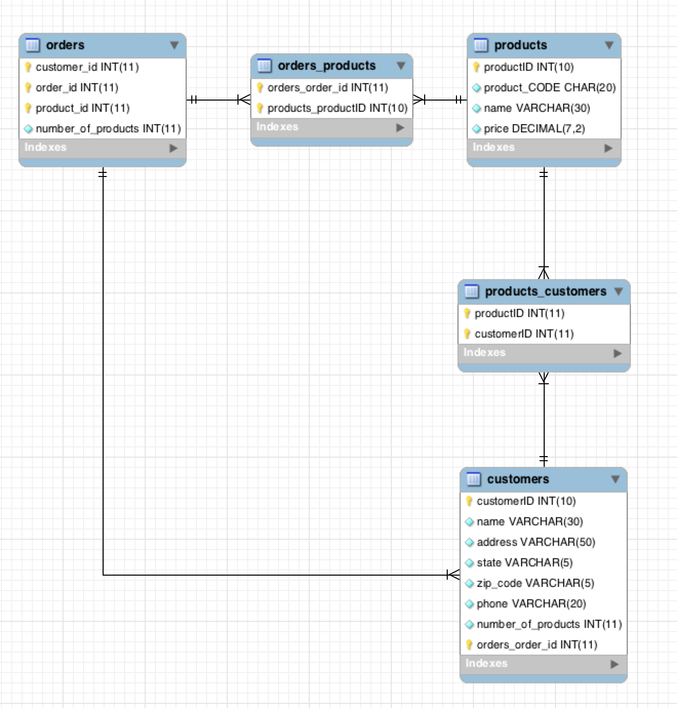

## TASK #1 continued

- Remove the quantity and customer_id from the products table. Also insert a product_id field.

```
ALTER TABLE `store`.`products` DROP COLUMN `customer_id` , DROP COLUMN `quantity` , ADD COLUMN `product_id` INT(10) NOT NULL DEFAULT 0  AFTER `price`
, DROP INDEX `customer_id` ;
```


```
UPDATE `store`.`products` SET `product_id`='1' WHERE `productID`='1';
UPDATE `store`.`products` SET `product_id`='1' WHERE `productID`='2';
UPDATE `store`.`products` SET `product_id`='2' WHERE `productID`='3';
UPDATE `store`.`products` SET `product_id`='1' WHERE `productID`='4';
UPDATE `store`.`products` SET `product_id`='3' WHERE `productID`='5';
```

```
mysql> SELECT * FROM products;
+-----------+--------------+--------+--------+------------+
| productID | product_CODE | name   | price  | product_id |
+-----------+--------------+--------+--------+------------+
|         1 | PEN          | Blue   |   1.25 |          1 |
|         2 | PEN          | Red    |   2.25 |          2 |
|         3 | NOTEBOOK     | Blank  |   5.25 |          3 |
|         4 | MARKER       | Yellow |   3.25 |          4 |
|         5 | PAPER        | White  |   1.25 |          5 |
|         6 | DESK         | Brown  | 100.25 |          6 |
+-----------+--------------+--------+--------+------------+
6 rows in set (0.00 sec)
```


- Create a new table orders with fields order_id, customer_id, product_id, number_of_products. Populate with some data. Eg.
In amazon you can order several products and multiple numbers of each product.


```
CREATE  TABLE `store`.`orders` (
  `order_id` INT NOT NULL ,
  `customer_id` INT NOT NULL ,
  `product_id` INT NOT NULL ,
  `number_of_products` INT NOT NULL ,
  PRIMARY KEY (`order_id`) );
```

```
INSERT INTO `store`.`orders` (`order_id`, `customer_id`, `product_id`, `number_of_products`) VALUES ('100', '501', '1', '10');
INSERT INTO `store`.`orders` (`order_id`, `customer_id`, `product_id`, `number_of_products`) VALUES ('101', '501', '4', '2');
INSERT INTO `store`.`orders` (`order_id`, `customer_id`, `product_id`, `number_of_products`) VALUES ('102', '501', '7', '1');
INSERT INTO `store`.`orders` (`order_id`, `customer_id`, `product_id`, `number_of_products`) VALUES ('103', '503', '2', '4');
INSERT INTO `store`.`orders` (`order_id`, `customer_id`, `product_id`, `number_of_products`) VALUES ('104', '503', '6', '1');
INSERT INTO `store`.`orders` (`order_id`, `customer_id`, `product_id`, `number_of_products`) VALUES ('105', '502', '3', '3');
INSERT INTO `store`.`orders` (`order_id`, `customer_id`, `product_id`, `number_of_products`) VALUES ('106', '502', '1', '5');
INSERT INTO `store`.`orders` (`order_id`, `customer_id`, `product_id`, `number_of_products`) VALUES ('107', '504', '7', '5');
INSERT INTO `store`.`orders` (`order_id`, `customer_id`, `product_id`, `number_of_products`) VALUES ('108', '504', '6', '1');
```

```
mysql> SELECT * FROM orders;
+----------+-------------+------------+--------------------+
| order_id | customer_id | product_id | number_of_products |
+----------+-------------+------------+--------------------+
|      100 |         501 |          1 |                 10 |
|      101 |         501 |          4 |                  2 |
|      102 |         501 |          7 |                  1 |
|      103 |         503 |          2 |                  4 |
|      104 |         503 |          6 |                  1 |
|      105 |         502 |          3 |                  3 |
|      106 |         502 |          1 |                  5 |
|      107 |         504 |          7 |                  5 |
|      108 |         504 |          6 |                  1 |
+----------+-------------+------------+--------------------+
9 rows in set (0.00 sec)
```


- Create a query which will list for each customer the total amount purchased.


```
INSERT INTO `store`.`products` (`productID`, `product_CODE`, `name`, `price`) VALUES ('7', 'WHITE PAPER', 'White', '10.25');
```



```
CREATE  TABLE `store`.`orders_products` (
  `order_id` INT NOT NULL ,
  `product_id` INT NOT NULL ,
  PRIMARY KEY (`order_id`, `product_id`) );
```


```
CREATE TABLE orders_products (
         order_id   INT UNSIGNED  NOT NULL,
         product_id  INT UNSIGNED  NOT NULL,
         PRIMARY KEY (order_id, product_id),
                     -- uniqueness
         FOREIGN KEY (order_id)  REFERENCES orders (order_id),
         FOREIGN KEY (product_id) REFERENCES products (product_id)
       );
```

```
INSERT INTO `store`.`orders_products` (`order_id`, `product_id`) VALUES ('100', '1');
INSERT INTO `store`.`orders_products` (`order_id`, `product_id`) VALUES ('101', '4');
INSERT INTO `store`.`orders_products` (`order_id`, `product_id`) VALUES ('102', '7');
INSERT INTO `store`.`orders_products` (`order_id`, `product_id`) VALUES ('103', '2');
INSERT INTO `store`.`orders_products` (`order_id`, `product_id`) VALUES ('104', '6');
INSERT INTO `store`.`orders_products` (`order_id`, `product_id`) VALUES ('105', '3');
INSERT INTO `store`.`orders_products` (`order_id`, `product_id`) VALUES ('106', '1');
INSERT INTO `store`.`orders_products` (`order_id`, `product_id`) VALUES ('107', '7');
INSERT INTO `store`.`orders_products` (`order_id`, `product_id`) VALUES ('108', '6');
```

```
mysql> SELECT * FROM orders_products;
+----------+-----------+
| order_id | productID |
+----------+-----------+
|      100 |         1 |
|      101 |         4 |
|      102 |         7 |
|      103 |         2 |
|      104 |         6 |
|      105 |         3 |
|      106 |         1 |
|      107 |         7 |
|      108 |         6 |
+----------+-----------+
9 rows in set (0.00 sec)
```


```
mysql> SELECT customer_id, SUM(orders.number_of_products * products.price) AS "The total amount purchased"
    -> FROM orders
    -> INNER JOIN products
    -> ON products.product_id = orders.product_id
    -> GROUP BY orders.customer_id;
+-------------+----------------------------+
| customer_id | The total amount purchased |
+-------------+----------------------------+
|         501 |                      29.25 |
|         502 |                      22.00 |
|         503 |                     109.25 |
|         504 |                     151.50 |
+-------------+----------------------------+
4 rows in set (0.00 sec)
```


- Create a query which list all customers who have not bought “white paper”.


- Add a foreign key constraint

```
ALTER TABLE orders_products ADD FOREIGN KEY (order_id) REFERENCES orders (order_id);
```

```
ALTER TABLE orders_products ADD FOREIGN KEY (product_id) REFERENCES products (productID);
```

Error.


Ran into this problem twice:

------------------------
LATEST FOREIGN KEY ERROR
------------------------
2016-12-03 19:14:57 0x700000dd9000 Error in foreign key constraint of table store/#sql-5e_1d:
FOREIGN KEY (product_id) REFERENCES products (productID):
Cannot find an index in the referenced table where the
referenced columns appear as the first columns, or column types
in the table and the referenced table do not match for constraint.
Note that the internal storage type of ENUM and SET changed in
tables created with >= InnoDB-4.1.12, and such columns in old tables
cannot be referenced by such columns in new tables.
Please refer to http://dev.mysql.com/doc/refman/5.7/en/innodb-foreign-key-constraints.html for correct foreign key definition.

Keys have to be the same data types.
http://stackoverflow.com/questions/21526055/mysql-cannot-create-foreign-key-constraint


```
ALTER TABLE `store`.`orders_products` CHANGE COLUMN `order_id` `order_id` INT(11) UNSIGNED NOT NULL  , CHANGE COLUMN `product_id` `product_id` INT(11) UNSIGNED NOT NULL  ;
```


```
ALTER TABLE orders_products ADD FOREIGN KEY (product_id) REFERENCES products (productID);
```
